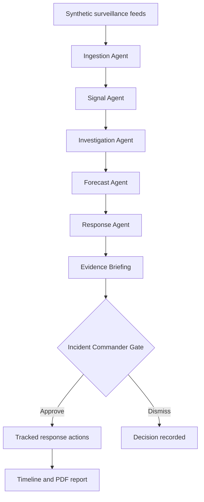

# Healthcare Crisis Prediction and Response Agent

A public-health decision-support application that monitors synthetic surveillance feeds, detects unusual disease activity, investigates corroborating evidence, forecasts short-term planning scenarios, and prepares bounded response actions for human approval.

The project uses synthetic, aggregated data only. It is not a diagnostic system and does not declare real outbreaks.

## Project scope

The current implementation covers three conditions selected for shared data structure and manageable surveillance complexity:

| Condition | Primary signals | Context |
|---|---|---|
| Influenza-like illness (ILI) | Visits, laboratory positives, pharmacy demand | Mobility and temperature |
| Acute gastroenteritis (AGE) | Visits, laboratory positives, pharmacy demand | Shared-location and regional context |
| Dengue | Suspected visits, laboratory positives, demand indicators | Rainfall and temperature |

The system monitors four simulated districts from 1 October 2025 through 30 September 2026.

## Workflow



Every execution returns a trace with component status and timing. Controlled response actions are never issued automatically.

## Main capabilities

- Multi-source surveillance for visits, laboratory positives, pharmacy demand, and regional context.
- Transparent baseline anomaly detection by region, condition, source, and date.
- Cluster investigation with source correlation, peak activity, data quality, rainfall, mobility, and temperature.
- Seven-day best-case, expected, and worst-case planning scenarios.
- Versioned response playbooks with owners, timeframes, approval requirements, and condition guidance.
- PDF, DOCX, YAML, and JSON playbook validation.
- Deterministic evidence briefings with optional Groq or Hugging Face generation.
- Incident Commander approval and dismissal workflow.
- Assigned action tracking with due dates and completion state.
- Chronological incident timeline and downloadable PDF situation report.

## Technology stack

| Layer | Technology |
|---|---|
| Dashboard | React, TypeScript, Vite, Recharts, Lucide |
| API | FastAPI, Pydantic, HTTPX |
| Database | Supabase Postgres; SQLite-compatible local design boundary |
| AI summaries | Deterministic fallback, optional Groq or Hugging Face |
| Playbooks | JSON, YAML, PDF, DOCX |
| Reports | ReportLab PDF generation |
| Local workflow | Python virtual environment, npm, Make, shell scripts |

Docker is not required. The project runs directly with a Python virtual environment and the Vite development server.

## Repository structure

```text
backend/app/       FastAPI routes and workflow components
frontend/src/      React command dashboard
data/              Deterministic synthetic-data generator
playbooks/         Active response playbook and format guidance
supabase/          Schema, policies, seed data, and migrations
scripts/           Local setup and development commands
DATASET_GUIDE.md   Dataset coverage and design notes
```

## Quick start

Requirements:

- Python 3.11 or newer
- Node.js 20 or newer
- npm
- Make and Bash

Install all dependencies:

```bash
make setup
```

Configure `backend/.env` using `backend/.env.example`. The final credential checklist is below.

Start the API and dashboard together:

```bash
make dev
```

Open:

- Dashboard: `http://127.0.0.1:5173`
- API documentation: `http://127.0.0.1:8000/docs`
- Health check: `http://127.0.0.1:8000/health`

Individual services can be started with `make api` and `make web`.

## Useful commands

```bash
make setup   # Install pinned Python and frontend dependencies
make dev     # Run API and dashboard without Docker
make check   # Compile the backend and build the frontend
make data    # Regenerate deterministic synthetic CSV files
```

## Demonstration scenarios

Use these dates in the dashboard to demonstrate known synthetic patterns:

| Date | Scope | Expected behavior |
|---|---|---|
| 10 November 2025 | Lakeside District / AGE | Corroborated investigation signal |
| 15 December 2025 | Central District / ILI | Corroborated investigation signal |
| 15 December 2025 | East District / Dengue | Corroborated investigation signal |
| 30 September 2026 | Central District / ILI | No active threshold signal |

## API overview

| Endpoint | Purpose |
|---|---|
| `GET /api/v1/regions` | Available regions |
| `GET /api/v1/conditions` | Monitored conditions |
| `GET /api/v1/observations` | Filtered aggregate surveillance observations |
| `GET /api/v1/signals` | Rule-based signal and cluster output |
| `GET /api/v1/investigation` | Correlated cluster evidence |
| `GET /api/v1/forecast` | Seven-day planning scenarios |
| `GET /api/v1/response-plan` | Bounded playbook actions |
| `GET /api/v1/briefing` | Stakeholder evidence briefing |
| `GET /api/v1/workflow` | Complete workflow trace |
| `GET /api/v1/alerts` | Protected approval queue |
| `POST /api/v1/alerts/generate` | Create eligible alerts idempotently |
| `PATCH /api/v1/alerts/{id}/decision` | Approve or dismiss an alert |
| `GET /api/v1/actions` | Protected incident actions |
| `PATCH /api/v1/actions/{id}` | Assign or update an action |
| `GET /api/v1/incidents/{id}/timeline` | Incident audit timeline |
| `GET /api/v1/incidents/{id}/report.pdf` | Downloadable situation report |
| `POST /api/v1/playbooks/validate` | Validate an uploaded playbook |

Interactive request and response schemas are available through FastAPI at `/docs`.

## Data and security boundaries

- No patient-level data, names, clinical records, or real health events are stored.
- Public browser access is read-only and limited to synthetic reference and surveillance tables.
- Alerts and incident actions have RLS enabled and no anonymous or authenticated policies.
- The Supabase secret key is used only by FastAPI and must never be placed in frontend files.
- AI providers receive prepared aggregate evidence only and cannot change alert levels or decisions.
- Groq and Hugging Face failures return a deterministic evidence summary.
- PDF and DOCX playbooks require an embedded structured section and are validated before use.
- Human approval is required before controlled response tasks are created.

## Supabase project

- Project name: `healthcare-crisis-response-agent`
- Region: `ap-south-1`
- Project reference: `jinbmggobfeccvqrnnze`

The database currently contains four simulated regions, three monitored conditions, 11,680 surveillance observations, and 1,460 regional-context records. Schema changes are tracked in `supabase/migrations/`.

## Final environment configuration

Backend variables:

| Variable | Required | Purpose |
|---|---|---|
| `SUPABASE_URL` | Yes | Supabase project API URL |
| `SUPABASE_PUBLISHABLE_KEY` | Yes | Read-only synthetic surveillance access |
| `SUPABASE_SECRET_KEY` | For protected workflows | Server-only alert, action, timeline, and report access |
| `ALLOWED_ORIGINS` | Yes | Dashboard origins allowed by CORS |
| `AI_PROVIDER` | No | `deterministic`, `groq`, or `huggingface` |
| `GROQ_API_KEY` and `GROQ_MODEL` | When using Groq | Groq summary generation |
| `HUGGINGFACE_TOKEN` and `HUGGINGFACE_MODEL` | When using Hugging Face | Hugging Face summary generation |

Frontend variables:

| Variable | Default | Purpose |
|---|---|---|
| `VITE_API_URL` | `http://localhost:8000` | FastAPI base URL |

Never use `VITE_` variables for Supabase secret or AI-provider credentials; Vite exposes them to the browser.

## Important limitation

This repository demonstrates surveillance, investigation, coordination, and human-gated response using synthetic data. Its outputs must not be used for diagnosis, clinical decisions, public warnings, or declarations of real disease outbreaks.
